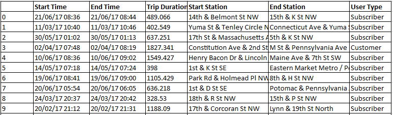
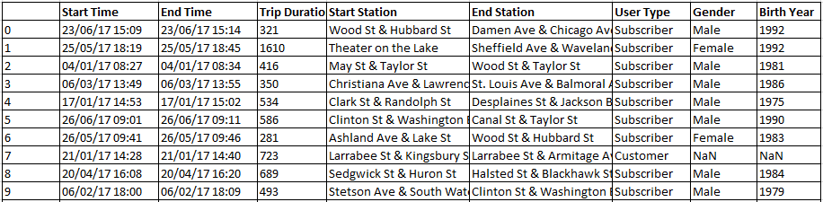
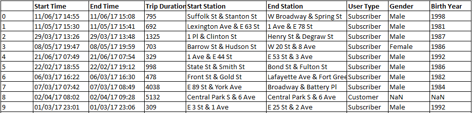

### Date created
Feb 2, 2021

### US Bikeshare Data Project
This project is a part of Programming for Data Science nanodegree at udacity.

### Description
This project provide an interactive experience where the users is asked multiple questions and based on their answer the dataset will be filtered, Then it will show the users a descriptive statistics upon the desired city and timeframe. In addition it also display a raw data upon user request.

### Files used
Dataset files for three cities in United States the data is provided by Motivate (a bike share system provider in US).
* washington.csv
* chicago.csv
* new_york_city.csv

_Data for first 10 rows in washington.csv file._

_Data for first 10 rows in chicago.csv file._

_Data for first 10 rows in new_york_city.csv file._

### Software requirements
* Python version 3.8.5
* Pandas version 0.22
* Atom version 1.54
* A terminal application
